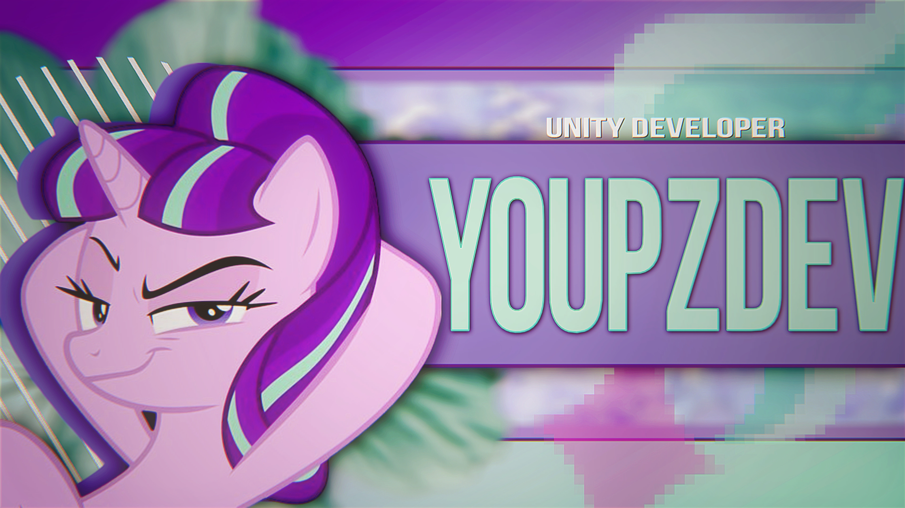

<h3>about</h3>

<b>Middle Unity Developer. 6 years in game development.</b> 
My main stack is Unity and Flutter. I also work on web projects and make low-poly assets in Blender.

<a href="https://youpzdev.ru">youpzdev.ru</a> / <a href="https://t.me/youpzz">Telegram</a> / <a href="https://t.me/youpzdev">Dev channel</a>

<h3>tech stack</h3>

<ul>
<li><b>Languages:</b> C#, Dart, C++, TypeScript, Python</li>
<li><b>Game development:</b> Unity, URP, Shader Graph, Yandex Games SDK</li>
<li><b>Mobile:</b> Flutter, Android, Yandex Mobile Ads</li>
<li><b>Web &amp; data:</b> React, Node.js, Supabase, PostgreSQL</li>
<li><b>Design &amp; 3D:</b> Blender, low-poly modeling, Figma</li>
<li><b>Tools:</b> Git, GitHub Actions, Docker, Gradle</li>
</ul>

<h3>activity</h3>

